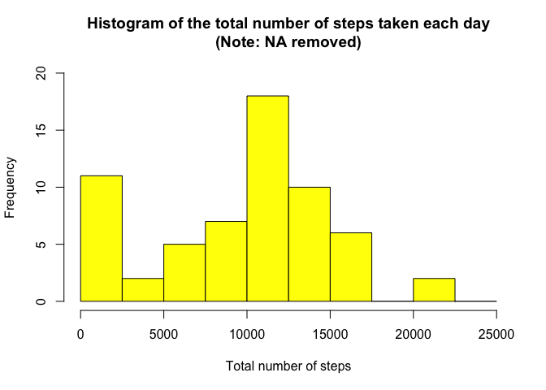
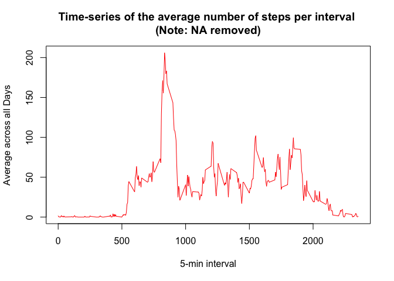
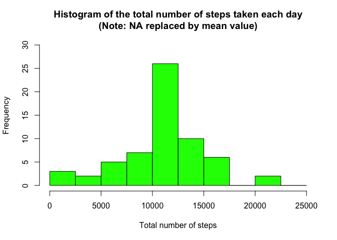
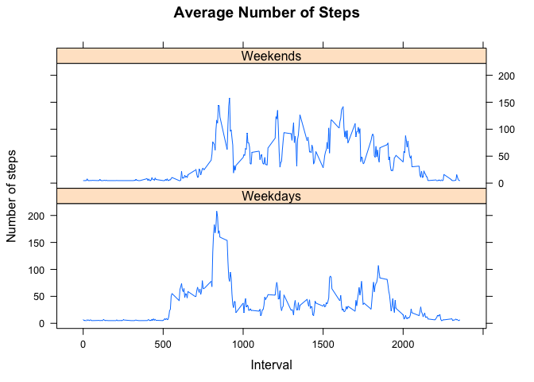

# RepData_PeerAssessment1
Philippe-C  
18 April 2015  

This assignment is part of the Coursera "Reproducible Research" course from the Data Science specialization. It makes use of data from a personal activity monitoring device. This device collects data at 5 minute intervals through out the day. The data consists of two months of data from an anonymous individual collected during the months of October and November, 2012 and include the number of steps taken in 5 minute intervals each day.

Furthermore, this assignment use R markdown to write a report that answers a series of questions detailed in the sections below. Using Knitr in Rstudio, this file will be transformed into a HTML and a md file (including the figures requested).

Therefore, the reader should be able to follow the instructions given in the document and reproduce exactly the same results.

(Please note that the R version used is 3.1.3 on MAC OS Maverick 10.9.5 and that more information regarding the dataset itself are available in the README file)

### Loading and preprocessing the data:

We assume that the working directory has been set correctly using the R setwd() function.

In addition, we assume that the data (17568 observations) collected from the personal monitoring device have already been unzip.

(if not, it can be done easily with the R function: unzip("activity.zip"))

We also have the following initial settings:
        

```r
        echo = TRUE  # Always make code visible
        options(scipen = 1)  # Turn off scientific notations for numbers
```
        
* Loading the data of the assignment requires the following code:
        

```r
        # Clear the workspace
        rm(list=ls())

        # Load the raw activity data
        rawdata <- read.csv("activity.csv", stringsAsFactors=FALSE)
```
        
* Processing the raw data requires the following steps:


```r
        # How to get an actual date format
        rawdata$date <- as.POSIXct(rawdata$date, format="%Y-%m-%d")

        # How to determine the weekdays
        rawdata <- data.frame(date=rawdata$date, 
                           weekday=tolower(weekdays(rawdata$date)), 
                           steps=rawdata$steps, 
                           interval=rawdata$interval)

        # How to determine the day type (weekend or weekday)
        rawdata <- cbind(rawdata, 
                      daytype=ifelse(rawdata$weekday == "saturday" | 
                      rawdata$weekday == "sunday", "weekend", 
                      "weekday"))

        # How to create the activity data.frame
        activity <- data.frame(date=rawdata$date, 
                       weekday=rawdata$weekday, 
                       daytype=rawdata$daytype, 
                       interval=rawdata$interval,
                       steps=rawdata$steps)
```
        
Now, let's have a quick first look at the data:
        

```r
        head(activity)
```

```
##         date weekday daytype interval steps
## 1 2012-10-01  monday weekday        0    NA
## 2 2012-10-01  monday weekday        5    NA
## 3 2012-10-01  monday weekday       10    NA
## 4 2012-10-01  monday weekday       15    NA
## 5 2012-10-01  monday weekday       20    NA
## 6 2012-10-01  monday weekday       25    NA
```

### What is mean total number of steps taken per day?

In order to answer this question, we will:

* Create a new dataset ignoring missing data NA

* Plot an histogram of the total number of steps taken each day}

* Report the mean and median total number of steps taken per day}   
        

```r
        # How to removes the missing values and compute the total number of steps each day using the R function aggregate
        activity_steps <- aggregate(activity$steps, by=list(activity$date), FUN=sum, na.rm=TRUE)
        
        # How to rename the attributes
        names(activity_steps) <- c("Date", "Total")
```

Let's have a look at this data:
        

```r
        head(activity_steps)
```

```
##         Date Total
## 1 2012-10-01     0
## 2 2012-10-02   126
## 3 2012-10-03 11352
## 4 2012-10-04 12116
## 5 2012-10-05 13294
## 6 2012-10-06 15420
```
        
Drawing the histogram requires the following R code:
        

```r
        hist(activity_steps$Total, breaks=seq(from=0, to=25000, by=2500),
        col="yellow", xlab="Total number of steps", ylim=c(0, 20), main="Histogram of the total number of steps taken each day\n(Note: NA removed)")
```

 
        
Finally, the mean (and median) total of daily steps can be easily computed.
        

```r
        mean(activity_steps$Total)
```

```
## [1] 9354.23
```

```r
        median(activity_steps$Total)
```

```
## [1] 10395
```
        
### What is the average daily activity pattern?

In order to answer this question, we will:

* Make a time series (TS) plot of the 5-minute interval (x-axis) and the average number of steps taken, averaged across all days (y-axis)

* Determine which 5-minute interval, on average across all the days in the dataset, contains the maximum number of steps

We can compute the means of steps accross all days for each interval using the following code:


```r
        library(dplyr)
```

```
## 
## Attaching package: 'dplyr'
## 
## The following object is masked from 'package:stats':
## 
##     filter
## 
## The following objects are masked from 'package:base':
## 
##     intersect, setdiff, setequal, union
```

```r
        TS<- tapply(activity$steps, activity$interval, mean, na.rm = TRUE)                                
```

Let's have a look at these data:
        

```r
        head(TS)
```

```
##         0         5        10        15        20        25 
## 1.7169811 0.3396226 0.1320755 0.1509434 0.0754717 2.0943396
```

Now, we can draw the time series plot:


```r
        plot(row.names(TS), TS, type = "l", xlab = "5-min interval", 
        ylab = "Average across all Days", 
        main = "Time-series of the average number of steps per interval \n(Note: NA removed)",
        col="red")
```

 
        
Finally, 835 which represents the 5 minutes interval that contains the maximum of steps (on average across all day) is given by:


```r
        # How to find this position
        maximum <- which.max(TS)
        names(maximum)
```

```
## [1] "835"
```

In other words, on the basis of the observations recorded by the monitoring device, the peak of activity is around 08:35 in the morning.

### Imputing missing values:

There are a number of days/intervals where there are missing values (coded as NA). The presence of missing days may introduce bias into some calculations or summaries of the data.

Therefore, we will:

* Calculate and report the total number of missing values in the dataset.

* Implement a strategy for filling in all of the missing values in the dataset (A possible strategy is to use the mean for that 5-minute interval to replace missing values. 

* Then we can create a new dataset that is equal to the original dataset but with the missing data filled in).

* Make a histogram of the total number of steps taken each day. Calculate and report the mean and median total number of steps taken per day and compare the results with those obtained in the first part of the assignment. What is the impact of imputing missing data?

Finding the NAs is straightforward with the use of the is.na function:


```r
        missing_values <- is.na(activity$steps)
        table(missing_values)
```

```
## missing_values
## FALSE  TRUE 
## 15264  2304
```

```r
        percentage<- (2304/17568)*100
        percentage
```

```
## [1] 13.11475
```

So, there are 2304 missing values which represents no less than 13% of the data.

The implementation of the strategy is explained below:


```r
# How to find the NA positions
NA_position <- which(is.na(activity$steps))

# How to create a vector of steps means
means_vector <- rep(mean(activity$steps, na.rm=TRUE), times=length(NA_position))
```

Then we can replace each NA by the mean of the steps attribute and create a new dataset which is simply the original dataset with the missing values filled in.


```r
# How to replace the NAs by the means vector
activity[NA_position, "steps"] <- means_vector
newactivity<- activity[NA_position, "steps"]
```

Let's have a look at the new activity dataset:


```r
head(activity)
```

```
##         date weekday daytype interval   steps
## 1 2012-10-01  monday weekday        0 37.3826
## 2 2012-10-01  monday weekday        5 37.3826
## 3 2012-10-01  monday weekday       10 37.3826
## 4 2012-10-01  monday weekday       15 37.3826
## 5 2012-10-01  monday weekday       20 37.3826
## 6 2012-10-01  monday weekday       25 37.3826
```

```r
sum(is.na(activity))
```

```
## [1] 0
```

There are effectively no missing values anymore.

Using the following code, we will be able to create the requested histogram:


```r
# How to compute the total number of steps each day (NA values being replaced)
steps_count <- aggregate(activity$steps, by=list(activity$date), FUN=sum)

# How to rename the attributes
names(steps_count) <- c("Date", "Total")
head(steps_count)
```

```
##         Date    Total
## 1 2012-10-01 10766.19
## 2 2012-10-02   126.00
## 3 2012-10-03 11352.00
## 4 2012-10-04 12116.00
## 5 2012-10-05 13294.00
## 6 2012-10-06 15420.00
```

```r
# How to create the histogram 
hist(steps_count$Total, 
     breaks=seq(from=0, to=25000, by=2500),
     col="green", 
     xlab="Total number of steps", 
     ylim=c(0, 30), 
     main="Histogram of the total number of steps taken each day\n(Note: NA replaced by mean value)")
```

 

Again, we compute the mean and the median of the estimate total number of steps per day:


```r
mean(steps_count$Total)
```

```
## [1] 10766.19
```

```r
median(steps_count$Total)
```

```
## [1] 10766.19
```

After taking account of the missing values, we observe that their impact is significant, the values obtained differ from those obtained in the first analysis with NAs being removed. By imputing the NAs, we have in fact gathered more data (refining our estimation), hence we have obtained a bigger mean and median values for the estimate number of daily steps recorded by the monitoring device.

### Are there differences in activity patterns between weekdays and weekends?

In order to answer that question, we will:

* Create a new factor variable in the dataset with two levels – “weekday” and “weekend” indicating whether a given date is a weekday or weekend day.

* Make a panel plot containing a time series plot  of the 5-minute interval (x-axis) and the average number of steps taken, averaged across all weekday days or weekend days (y-axis). 

We use the last activity data set (containing the missing values) and we build the new two levels factor variable using the following code:

```r
# How to use the weekdays R function
day <- weekdays(activity$date)

# How to determine the new factor variable
daylevel <- vector()
for (i in 1:nrow(activity)) {
    if (day[i] == "Saturday") {
        daylevel[i] <- "Weekends"
    } else if (day[i] == "Sunday") {
        daylevel[i] <- "Weekends"
    } else {
        daylevel[i] <- "Weekdays"
    }
}
activity$daylevel <- daylevel
activity$daylevel <- factor(activity$daylevel)

steps_by_day <- aggregate(steps ~ interval + daylevel, data = activity, mean)
names(steps_by_day) <- c("Interval", "DayLevel", "Steps")
```

We can finally create the requested graphic:


```r
library("lattice")
xyplot(Steps ~ Interval | DayLevel, steps_by_day, type = "l", main="Average Number of Steps", layout = c(1, 2), xlab = "Interval", ylab = "Number of steps")
```

 

The two graphs show clearly that the distribution throughout the days is quite different. According to the data recorded and regarding the sleep pattern, the individual seems to wake up at least one hour later at the weekends.

We can also  notice that the recorded number of steps crosses the 2OO threshold only on weekdays: we can make the hypothesis that it may be related to the fact that the individual walks to work (this pattern does not appear during the weekend and we have seen earlier that this peak of activity occurs around 08:35 in the morning).

Finally, during the weekend, the steps measured are more evenly spaced and the individual is globally more active (we observe more peaks over 100 steps). In other words, this individual seems to have a relatively sedentary work during the week (he might work in an office) and he seems to use its free time to be more active on weekends. 


